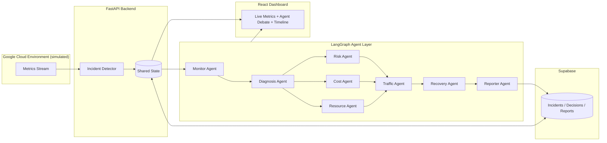

<div align="center">

# 🛰️ HIVE Nebula

### An Autonomous Multi-Agent Incident Commander for Google Cloud Infrastructure

*When servers fail at 2 AM, HIVE doesn't wait for an engineer to wake up — it plans, debates, and recovers on its own.*


</div>

---

## 📑 Table of Contents

1. [Project Title](#-hive-nebula)
2. [Team Details](#-team-details)
3. [Problem Statement](#-problem-statement)
4. [Solution Overview](#-solution-overview)
5. [Key Features](#-key-features)
6. [Tech Stack](#-tech-stack)
7. [System Architecture](#-system-architecture)
8. [Detailed Workflow](#-detailed-workflow)
9. [AI/ML Workflow](#-aiml-workflow)
10. [Folder Structure](#-folder-structure)
11. [Installation Guide](#-installation-guide)
12. [Usage Guide](#-usage-guide)
13. [API Documentation](#-api-documentation)
14. [Security Measures](#-security-measures)
15. [Testing & Performance](#-testing--performance)
16. [Challenges Faced](#-challenges-faced)
17. [Future Scope](#-future-scope)
18. [Demo](#-demo)
19. [References](#-references)

> Sections 9–19 are owned by other teammates and are stubbed below so the document reads as one coherent file — fill them in as those parts land.

---

## 👥 Team Details
| _Member 1_ |THASLIMA NASREEN J|
| _Member 2_ |THAMARAI V |
| _Member 3_ | RIHIKA K |


##  Problem Statement

### Background
Modern cloud platforms (AWS, Azure, Google Cloud) run thousands of interdependent services. A single failure — a memory leak, a crashed container, a saturated network link — can cascade into an outage affecting thousands of users within minutes. Cloud providers invest heavily in monitoring, but **monitoring is not the same as recovery**.

### Current Challenges
- **Manual coordination** — incidents are triaged by on-call engineers who must correlate alerts, diagnose root cause, and decide on a fix, often at odd hours.
- **Alert fatigue** — a single incident can trigger dozens of overlapping alerts across different subsystems, making it hard to see the actual root cause.
- **Slow recovery** — the gap between "alert fired" and "service restored" is dominated by human investigation time, not by the actual fix.
- **Human dependency** — recovery quality depends on which engineer is on call and how experienced they are with that specific failure mode.

### Gap
Existing observability tools (Prometheus, Datadog, Cloud Monitoring, etc.) are excellent at **detecting** anomalies but stop short of **deciding and acting**. They surface a dashboard full of red numbers and leave the reasoning and the recovery entirely to a human.

### Objective
Build an autonomous AI workforce — a set of specialized, cooperating agents — that can:
1. Detect an incident from live infrastructure metrics.
2. Diagnose the likely root cause.
3. Debate and weigh trade-offs (cost, risk, downtime) between possible recovery strategies.
4. Execute the chosen recovery action.
5. Report a clear, human-readable root-cause summary — all without waking anyone up.

---

## 💡 Solution Overview

**HIVE Nebula** is a multi-agent orchestration platform that continuously monitors a Google Cloud environment, detects incidents in real time, and lets a team of specialized AI agents collaboratively decide the optimal recovery strategy — then executes that recovery automatically.

Instead of a single model making a black-box decision, HIVE splits reasoning across role-specific agents (Monitoring, Diagnosis, Resource, Cost, Risk, Traffic, Recovery, and Reporting) that **converse with each other** the way a real incident-response team would — proposing actions, raising cost or risk objections, and reaching a consensus — before anything is executed on the infrastructure.

The result is a **living dashboard**: no chatbot box, no manual clicks. You inject a failure, and you watch the agents notice it, argue about the best fix, act on it, and explain what happened afterward.

```
Cloud Metrics → Incident Detection → Agent Debate → Consensus Plan → Automated Recovery → Root-Cause Report
```

**Scope note:** the current prototype targets **Google Cloud** specifically (chosen for its strong native AI/monitoring APIs and to keep the 24-hour build focused). The orchestration engine itself is provider-agnostic — extending it to AWS or Azure is future scope, not a current claim.

---

## ⭐ Key Features

| Feature | Purpose | Why It Matters |
|---|---|---|
| **Incident Detection** | Continuously watches cloud metrics (CPU, memory, network, error rates) to flag abnormal behavior. | Catches failures the moment they start, not after users complain. |
| **AI Debate Engine** | Specialized agents independently analyze an incident and argue toward a consensus, instead of one model deciding alone. | Improves decision quality, transparency, and makes the reasoning auditable. |
| **Dependency Analysis** | Maps which services and containers are affected downstream of a failing component. | Prevents recovery actions that fix one thing and silently break another. |
| **Recovery Planning** | Converts the agreed-upon strategy into a concrete, ordered set of recovery actions. | Turns discussion into execution, closing the loop without human intervention. |
| **Root Cause Report** | Automatically generates a plain-language incident summary after recovery. | Gives on-call teams a postmortem instantly, instead of hours of manual log digging. |
| **Live Dashboard** | Real-time visualization of servers, agent conversations, and the recovery timeline. | Makes autonomous behavior visible and demonstrable, not a black box. |

---

## 🛠️ Tech Stack

| Layer | Technology | Purpose |
|---|---|---|
| Frontend | React | Live incident dashboard |
| Styling | Tailwind CSS | UI design system |
| Backend | FastAPI | REST APIs, orchestration entry points |
| AI Reasoning | Gemini | Per-agent reasoning and debate generation |
| Agent Framework | LangGraph | Multi-agent orchestration and state management |
| Database | Supabase | Persisting incidents, agent decisions, reports |
| Visualization | React Flow | Agent/dependency graph rendering |
| Charts | Recharts | Live metrics (CPU, memory, network) |

---

## 🏗️ System Architecture

> Placeholder — swap this for the final exported architecture diagram (image or draw.io/Mermaid export) once it's designed. Kept here as a text version so the section isn't empty in the meantime.



**Component roles:**
- **Incident Detector** — ingests live/simulated metrics and flags anomalies.
- **Shared State** — the common blackboard all agents read from and write to.
- **Agent Layer** — each agent has one job and one voice in the debate; the Planner/Reporter agents synthesize the final decision and summary.
- **Supabase** — durable store for every incident, the agent debate transcript, and the resulting report.
- **Dashboard** — renders servers, live agent messages, and the recovery timeline with zero manual clicks.

---

## 🔄 Detailed Workflow

1. **Cloud metrics are received** — CPU, memory, network, and error-rate signals stream (or are simulated via a "Inject Chaos" trigger) into the backend.
2. **Monitor Agent detects anomalies** — flags the metric that crossed a threshold (e.g., CPU at 98%).
3. **Dependency Agent identifies impacted services** — maps which downstream containers/services are affected.
4. **Specialized AI agents independently analyze the incident** — Diagnosis, Cost, Risk, and Traffic agents each reason about the situation from their own angle.
5. **Agents debate** — e.g., Resource proposes a new container, Cost flags the hourly price, Risk estimates downtime probability, Traffic proposes shifting load.
6. **Planner Agent reaches a consensus** — weighs the trade-offs raised in the debate and picks one recovery strategy.
7. **Recovery Agent executes the selected strategy** — spins up resources, restarts services, or reroutes traffic as decided.
8. **Reporter Agent generates the incident report** — a root-cause summary written in plain language, stored alongside the full debate transcript.

```
Cloud Metrics
      │
      ▼
Incident Detection (Monitor Agent)
      │
      ▼
Dependency Analysis
      │
      ▼
Agent Debate (Diagnosis · Cost · Risk · Traffic)
      │
      ▼
Consensus Plan (Planner Agent)
      │
      ▼
Automated Recovery (Recovery Agent)
      │
      ▼
Root-Cause Report (Reporter Agent)
```

---


<div align="center">

*Built for [Hackathon Name] — 2026*

</div>
